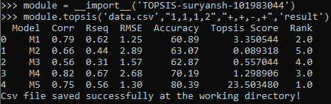

# TOPSIS-suryansh-101983044
This python module aims to implement Multiple Criteria Decision Making using TOPSIS ranking.
The module is available at https://pypi.org/project/TOPSIS-suryansh-101983044/0.1/.
## Description
This module basically is a function which requires a CSV file as input which contains the model on which you wish to implement TOPSIS  along with impacts,weights and a name for the result file.The model basically builts a result csv file which has two additional columns, TOPSIS score and rank respectively. 
## Installation
Use package manager [pip](https://pip.pypa.io/en/stable/) to install the module.
```bash
pip install TOPSIS-suryansh-101983044
```
## Usage
After intalling the package use the following code:
```python

module =__import__('TOPSIS-suryansh-101983044')

module.topsis(file_name,weights,impacts,resultant_filename)
```
#### Illustration

#### Usage Contsraints
The  first attribute is a string containg the name of the input csv file.It should contain the input model and should be present in the working directory.
###### * It should have more than 3 columns.
###### * First column is the object/variable name.
###### * From 2nd to last columns contain numeric values only.

The second attribute is a string containing comma seperated weights.
Example: "1,1,1,1" 
###### * Weights should be numerical and should be separated by commas.

The third attribute is a string containing comma seperated impacts.
Example: "+,-,-,+"
###### * Impacts could either be '+' or '-'. Impacts should be comma separated.

###### * Number of WEIGHTS and IMPACTS must be equal to the number of COLUMNS(excluding the first object column) in the input file

## Authors
Suryansh Bhardwaj

## License
[MIT](https://choosealicense.com/licenses/mit/)


